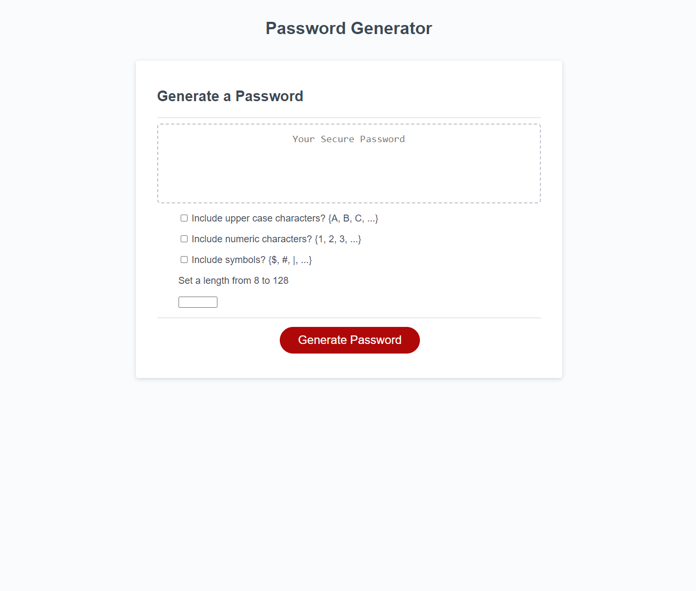
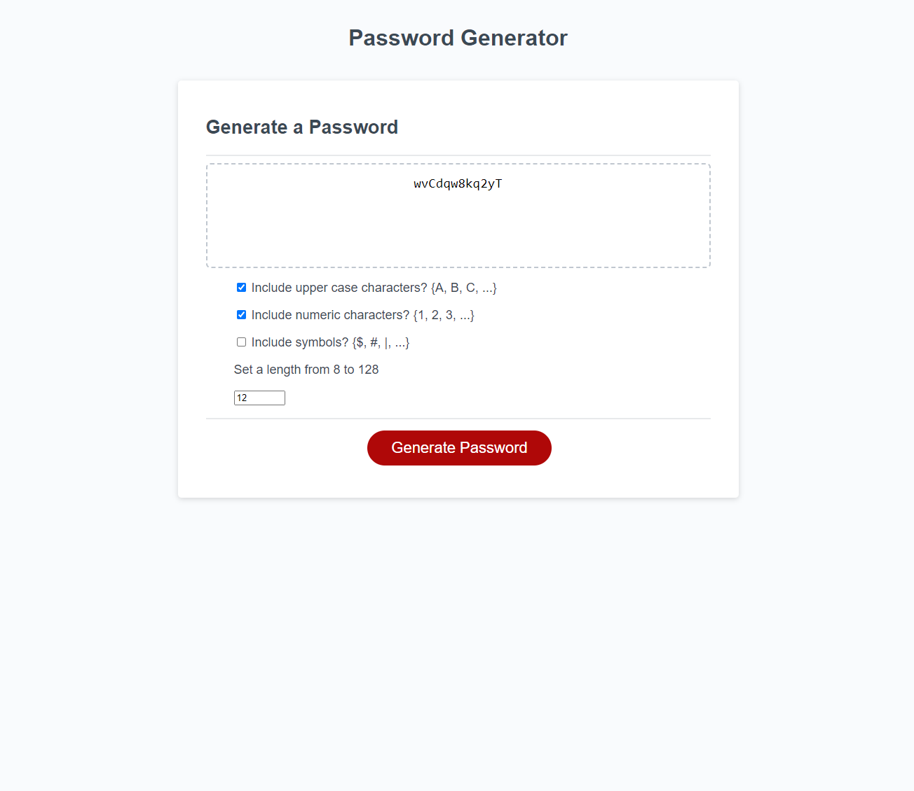

# strongboxGen
Uses JavaScript to generate complex passwords based on user specifications

---
## Table of Contents
[Description](###Description)

[Installation Instructions](###Installation-Instructions)

[Usage](###Usage)

[Contribution Guidelines](###Contribution-Guidelines)

[License](###License)

[Questions?](###Questions?)

### Description
>
> This application provides a simple frontend that allows users to generate a psuedorandom password. The application is not purely cryptographically secure, and it does not calculate password entropy.
>
> The motivation to create this application was to explore hash functions, investigate secure methods of generating bytes, and practicing converting datatypes between arrays, integers, ASCII characters, and strings.
>
> For future development, testing password entropy & only outputting sufficiently strong passwords, as well as testing against known rainbow tables would improve the security of passwords generated with the app. For user experience, the app should allow users to select how many of each character they would like, as well as options to exclude certain characters (dyslexia-friendly passwords, such as passwords which do not use ', ` or O and 0, since these are hard to differentiate.
---
### Deployment Link
>
> [Deployed Application](https://stevendreed.github.io/strongboxGen/)
---
### Installation Instructions
>
> Navigate to https://stevendreed.github.io/strongboxGen/ and run the application from the browser
---
### Usage
>
> Navigate to [Deployed Application](###Deployment-Link), and select the password options you would like. Click the `Generate Password` button, then copy your password from the display text field.
> Shown: application home page 
>
> Shown: application with sample output 
---
### Contribution Guidelines
>
> Email [Steven Reed](###Questions?) if you're interested in contributing!
---
### License
>
> 
---
### Sources
>
> Special thanks to UCB Extension for building the HTML framework & CSS stylesheets
>
> Additionally, see [Secure Random Numbers in JS](https://stackoverflow.com/questions/4083204/secure-random-numbers-in-javascript) for a fantastic overview of random int generation in JS
>
> Lastly, a stretch goal of this project was writing my own hash function. I got the idea for XOR shifting from FRANC¸OIS PANNETON and PIERRE L’ECUYER [On the Xorshift Random Number Generators](https://www.iro.umontreal.ca/~lecuyer/myftp/papers/xorshift.pdf)
---
### Questions?
>
> [github@stevendreed](https://github.com/stevendreed)
>
> [gmail@Steven Reed](mailto:steven.daniel.reed@gmail.com)
---
strongboxGen by Steven Reed `@github.com/stevendreed`
